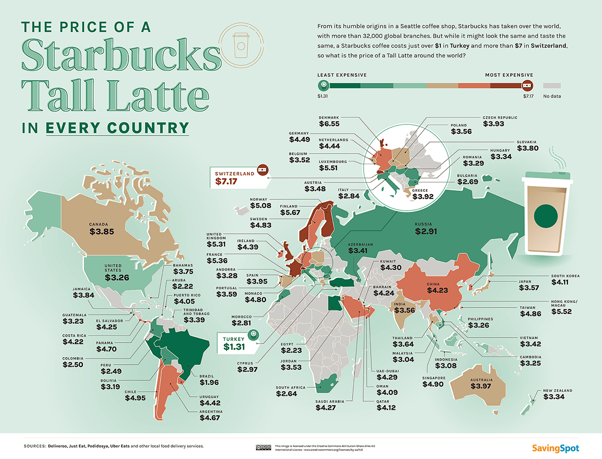
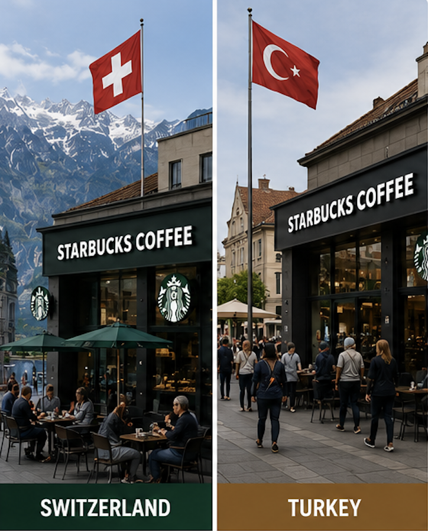
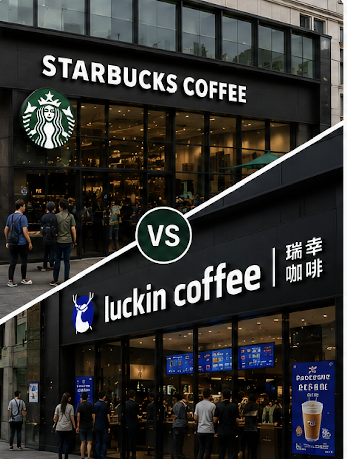
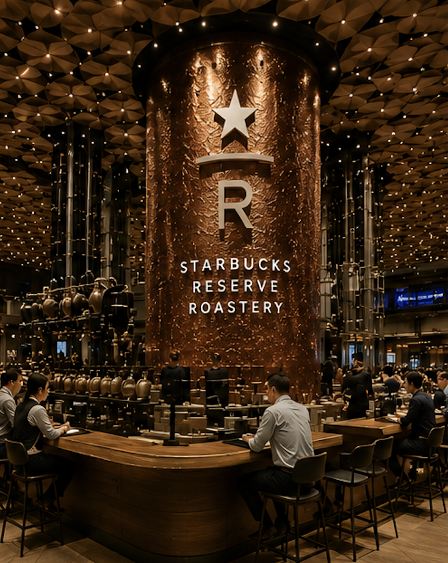

## A Global Pricing Puzzle

☕ <b>Tall Latte Prices</b> 
━━━━━━━━━━━━━━ 
🇹🇷 Turkey: <b>$1.31</b> 
🇺🇸 USA: <b>$3.26</b> 
🇨🇳 China: <b>$4.23</b> 
🇨🇭 Switzerland: <b>$7.17</b>

💡 <b>Key Observation:</b> 
━━━━━━━━━━━━━━ 
The same Starbucks Tall Latte can cost more than <b>five times as much</b> across countries.

---

## Why Are Prices Different?

━━━━━━━━━━━━

<h3 style="text-align:center;margin-top:0px;">💰 Income Levels</h3>

<h3>GDP per capita (2023)</h3>

• Switzerland ≈ $99,000 
• Turkey ≈ $13,000

Higher incomes support higher willingness to pay.

<h3 style="text-align:center;margin-top:0px;">🏪 Competition</h3>

<h3>Starbucks vs. Luckin Coffee</h3>

Local competitors can limit pricing power.

<h3 style="text-align:center;margin-top:0px;">⭐ Brand Positioning</h3>

<h3>Starbucks Reserve</h3>

Premium positioning can increase willingness to pay.

💡 <b>Key idea:</b> Income, competition, and brand positioning are key drivers of customer value, which in turn shapes willingness to pay.

---

## What Can Marketers Learn?

Global pricing should match local customer value, not simply production cost.

💰

<h3 style="margin:4px 0;">One Price Does Not Fit All</h3>
Consumers differ in purchasing power and willingness to pay.

🏪

<h3 style="margin:4px 0;">Competition Matters</h3>
Local rivals can limit pricing power and require promotions.

⭐

<h3 style="margin:4px 0;">Brand Creates Pricing Power</h3>
Premium brand perception allows firms to charge higher prices.

 

Customer Value &nbsp; → &nbsp; Willingness to Pay &nbsp; → &nbsp; Pricing Decision

 

📌 <b>Managerial Implication:</b>

Successful global pricing requires firms to adapt prices
to local customer value rather than applying
a single global price worldwide.

---

## Why Not Cost or Culture?

Common explanations that cannot fully account for global Starbucks pricing.

<h3 style="margin:0 0 8px 0;text-align:center;">
💲 Why Not Cost?
</h3>

<ul style="margin-top:0;margin-bottom:8px;">
<li>Material costs, such as coffee beans, milk, and packaging, represent only a small portion of the final price.</li>

<li>Labor, rent, and operating costs vary across countries, but firms can partly offset these differences through store format, location strategy, and franchising.</li>

<li>These cost differences are unlikely to explain why Starbucks prices vary by more than 5× across markets.</li>
</ul>

☕ Turkey $1.31 ↔ Switzerland $7.17

5.5× Price Difference

✓ Key Point: Prices differ far more than costs.

<h3 style="margin:0 0 8px 0;text-align:center;">
🌍 Why Not Culture?
</h3>

<ul style="margin-top:0;margin-bottom:8px;">

<li>Culture influences local preferences and product adaptation, such as seasonal drinks or region-specific menu items.</li>

<li>Starbucks' core products, including lattes and Americanos, are highly standardized worldwide.</li>

<li>Turkey and Switzerland both have strong coffee traditions, yet Starbucks prices differ dramatically.</li>

<li>Culture affects whether consumers buy Starbucks, but differences in customer value and willingness to pay play a more direct role in determining price.</li>

</ul>

✓ Key Point: Culture influences demand, but customer value is a more direct driver of pricing.

💡 <b>Key Insight:</b>

Cost and culture help explain local market conditions, but they cannot fully account for large global price differences.

<b>Customer value is the most direct driver of willingness to pay—and therefore pricing decisions.</b>

---

## Key Takeaways

 

<h3>🌍 Global Markets Differ</h3>

Customers around the world have different needs,
preferences, purchasing power,
and consumption habits.

<h3>☕ Value Is Perceived</h3>

Consumers are not only buying coffee—they are buying convenience, experience, and brand value.

<h3>📈 Pricing Is Strategic</h3>

Successful companies adapt prices to local market conditions rather than using one global price.

 

💡 <b>Final Message</b>

The same Starbucks drink can command very different prices across markets because customers perceive different levels of value and utility.

Successful pricing is not about what a product costs to make—
it is about what customers believe it is worth.

---

<h1 style="
font-size:3em;
color:#064d2f;
margin-bottom:20px;
">
Thank You!
</h1>

